# Perspective-taking with Embodiment Tokens🧍

This project is the first step to perspective-taking with [rotation tokens](https://github.com/bridgetleonard2/RotationTokens), where we used specialized tokens with orientation information to enable visual perspective-taking (VPT) in LLaVA 1.5 13B. Here, we use tokens that label body keypoint information of a human reference to enable VPT in LLaVA.

## 🔧 Set-up

```bash
git clone https://github.com/bridgetleonard2/EmbodimentTokens.git
cd EmbodimentTokens
```

**Optional: create keypoint data**
```bash
cd body_keypoints/dataset
python get_poses.py --use_vitpose False  # false to use coco, true to use vitpose keypoints
```
Use `atomic_items.ipynb` to create atomic training items

Use `reasoning_items.ipynb` to create CoT and direct training items from a specified subset of atomic items found in `cot_selection.json`

## Create fine-tuning data
Use `body_keypoints/create_perspective_annealing_data.ipynb` to create train_perspective_annealing_data*_keypointselection*.jsonl and make sure to specify what keypoint data you want to use.
Or download the data directly from [ViTPose data](https://drive.google.com/file/d/17hlSeB9aPzqpTmV3JnmODCs6IwMyqJl5/view?usp=sharing) or [COCO data](https://drive.google.com/file/d/17hlSeB9aPzqpTmV3JnmODCs6IwMyqJl5/view?usp=sharing).

## Fine‑tune
We ran training on an HPC node with 2 a-40 GPUs in a container with the package versions found in `llava.def`

```bash
apptainer run --nv ../llava_container.sif scripts/v1_5/finetune_task_lora_perspective_annealing.sh
```

## Evaluate

Many evaluations can be found in `data/evals` and run using the following template:

```bash
apptainer run --nv ../llava_container.sif   env PYTHONPATH=$(pwd)   python3 llava/eval/model_vpt.py   --model-path checkpoints/train_perspective_annealing-llava-v1.5-13b-task-lora  --model-base liuhaotian/llava-v1.5-13b   --question-file path_to_eval_question_file   --image-folder path_to_eval_image_folder  --answers-file path_to_eval_answers_output_file
```

For external evals, get images from these links and download them into an `image` directory in the corresponding folders:

- [3DSRBench](https://huggingface.co/datasets/ccvl/3DSRBench)
- [Isle Bricks V2](https://huggingface.co/datasets/Gracjan/Isle)
- [COCO val 2017](https://cocodataset.org/#download)

---

## 🗂️ Repo Structure
```
.
├── body_keypoints/
|   └── coco/
|   │   ├── curriculum_data/       # contains atomic and reasoning data
|   │   ├── cot_selection.json     # selected coco items for CoT task
|   |   └── keypoints_data.npy     # keypoints data for all atomic items
|   |
|   └── dataset/
|   │   ├── atomic_items.ipynb     # creates atomic items for fine-tuning
|   │   ├── get_poses.py           # retrieves keypoints from coco annotations or using ViTPose
|   |   └── reasoning_items.ipynb  # creates reasoning items for fine-tuning
|   |
|   └── vitpose/                   # same contents as body_keypoints/coco but with ViTPose keypoint data
|
├── data/
|   ├── evals/                     # includes other miscellaneous evals
|   |   ├──perspective_taking
|   |   └──pose_tokens
|   |
│   ├── images/                    # COCOimages
|   |
|   └── train_perspective_annealing_data.json
|
├── LLaVA/
│   ├── llava/
|   |   ├── eval/
|   |   |   └──model_vpt.py        # evaluation script
|   |   ├──model/
|   |   └──train/                  # training scripts
|   |
│   └── scripts/
|       └── v1_5/finetune_task_lora_perspective_annealing.sh
|
├── results.ipynb
|
├── llava.def                      # Apptainer def file
|
└── README.md
```

---

## 📊 Results
### Embodiment token distillation
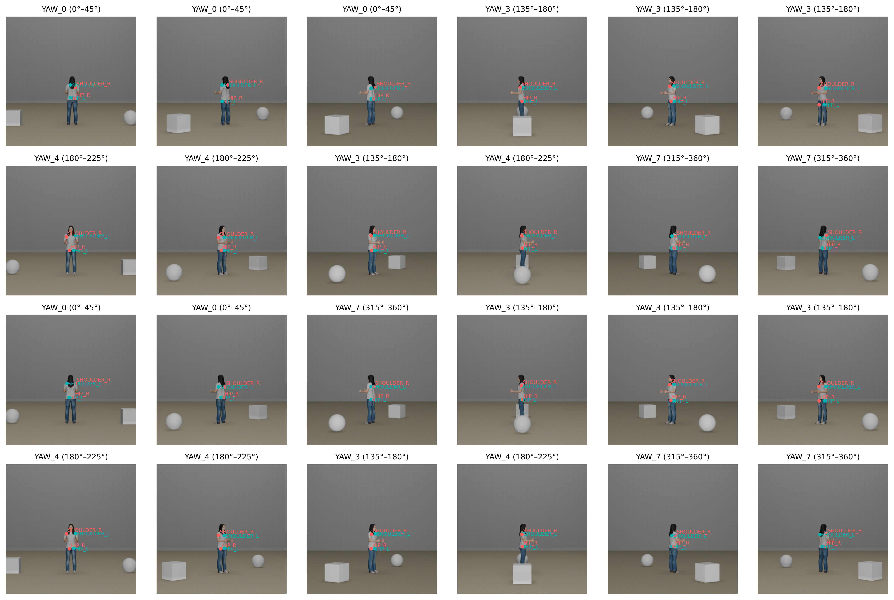

The model successfully learned to generate embodiment tokens with accurate left/right hip and shoulder labels. The accuracy of YAW labels are
specifically impressive due to the small size of the avatar relative to the image (small pixel distance between left and right points).

### Perspective-taking
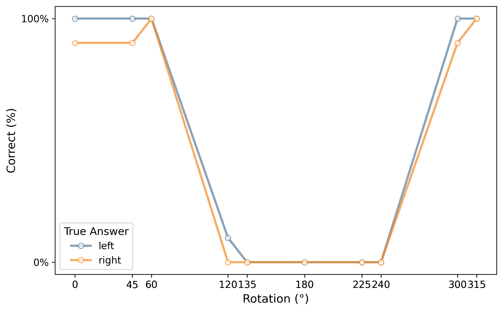
LLaVA performs remarkably similarly to GPT-4o as established previously by our [perspective taking benchmark](https://github.com/bridgetleonard2/PerspectiveTaking).
Poor performance at angles between 90°-270°, reflects a default to the image-based perspective. Many MLMs are inequipped to perform spatial reasoning due to these kinds of biases.

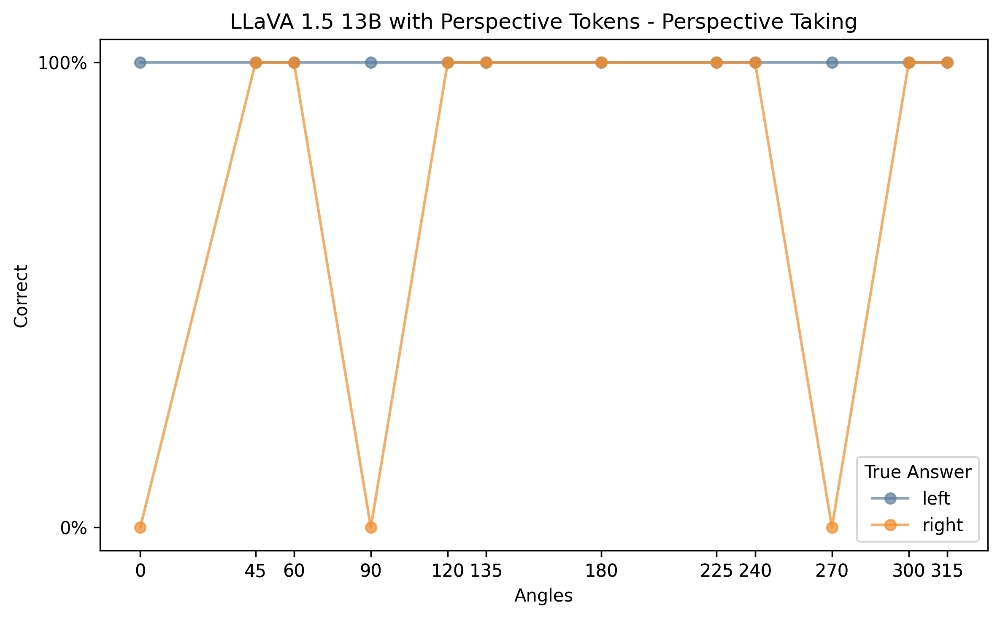
Model performance signficantly improves. In fact, it only fails at 0° and perpendicular angles for "right-cube" conditions. At perpendicular angles, the cube is neither to the left or right from the image-based perspective so improvement in CoT training where in front and behind can be adapted to make more general spatial judgments would likely improve this performance.

Failure at 0° is harder to interpret, but if chain of thought prompting is used for evaluation, this failure goes away. Interestingly, the default answer for perpendicular angles becomes 'right' when for direct prompting (above) it seemed to be 'left'

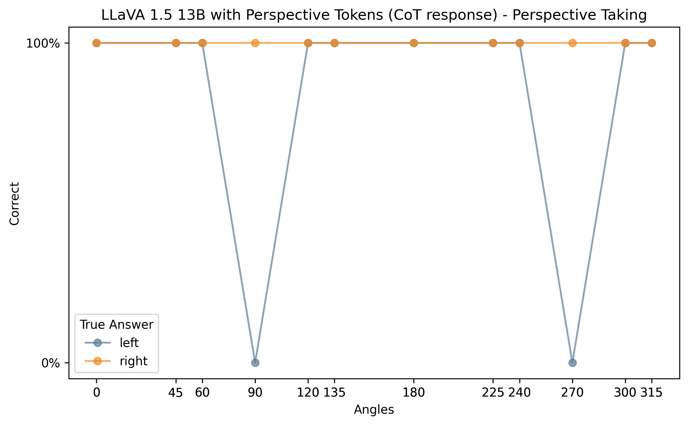

### Random results
When first investigating perspective taking in MLMs, we used various random stimuli found online or ones we generated using AI. Here is how the model performs on these "random" perspective taking tasks

#### Fire-hydrant task


LLaVA with perspective tokens successfully completes our original perspective-taking task using a fire hydrant and person.

#### Room task
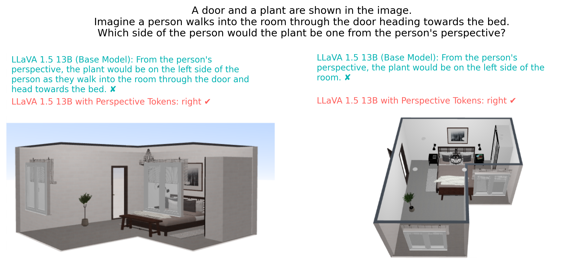

LLaVA with perspective tokens can even generalize to perspective-taking with inanimate objects (like a door) if prompted to image a person's orientation to that object.

### Pose tokens vs text tokens
#### Is the spatial specific information contained in pose tokens the reason for better performance?

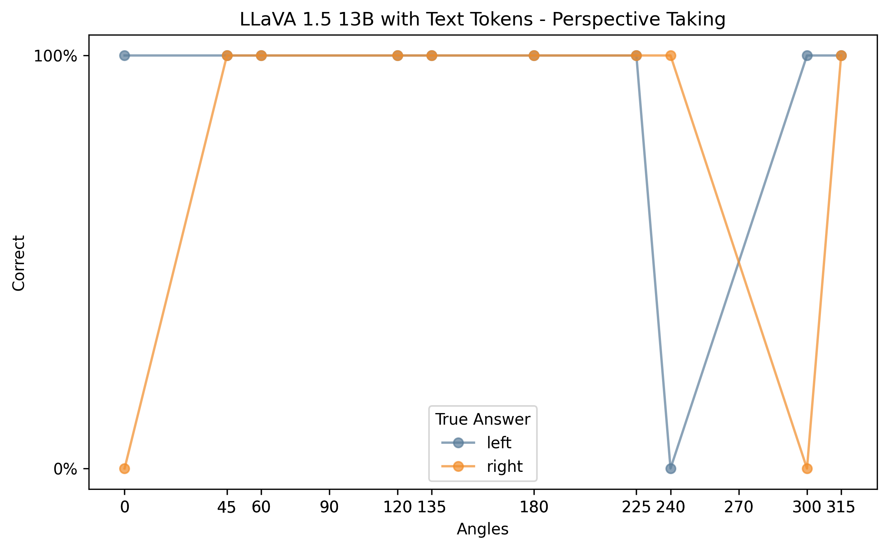

Training the model with standard tokens (100 instead of X_100) did not improve model performance to the extent that pose-tokens did. The model performs worse at 240° and 300°.

---
## 📈 Activation tracing

Code available in `activation_tracing.ipynb`

Using pytorch forward hooks, we extracted intermediate layer activations from 3 checkpoint layers in the model representing the 3 main components: vision tower, multimodal projector, and language model. We analyzed how representations of each perspective-taking benchmark item changed after fine-tuning the model with pose tokens.

### RSA

We first looked at how representations within the model aligned with the 5 key features in our data: alignment, egocentric cube direction, angle, angular difference, and allocentric cube direction. We saw significant differences between the base and fine-tuned model. Specifically, the fine-tuned model was more similar to the feature matrices of alignment, angle, and cube directions.

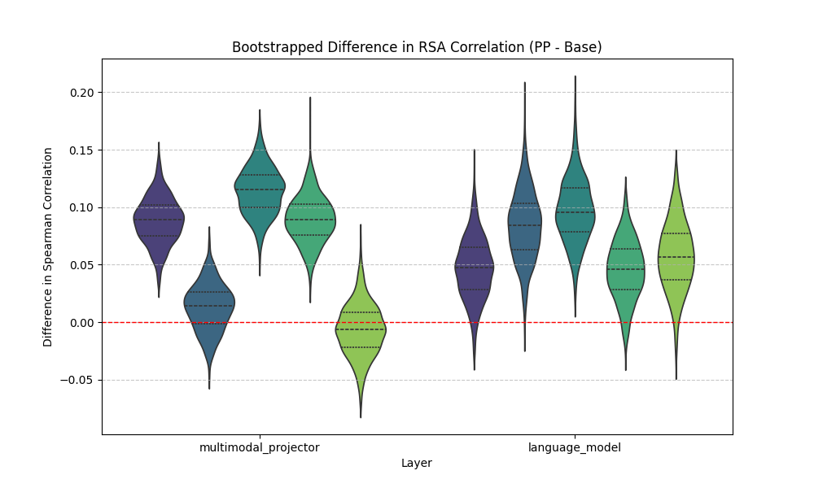

### Alignment

We first investigated both the base model and pose model to see if there were groups of neurons encoding the alignment of the image. This established what neurons were significantly more active during unaligned items (300-60°) than aligned items (120-240°). We then plotted the average neuron activity within this region of interest (ROI) for all the different input images:

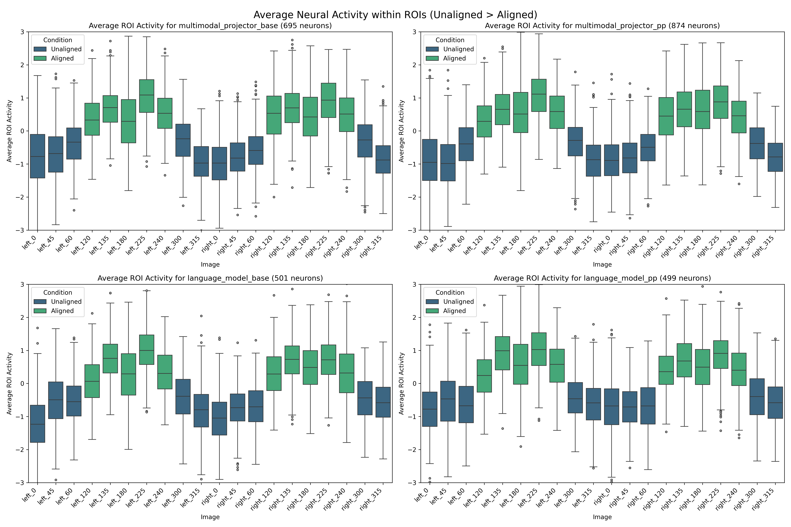

Surprisingly, neurons in the base model's ROI responded similarly in degree of activation with changing angles to the pose model. However, the pose model had larger ROIs (more neurons) in the multimodal layer activations.

### Egocentric cube direction

We next calculated ROIs for neurons more active in left cube conditions than right cube, and vice versa, based on the egocentric direction or image-view. We then plotted average activations for these ROIs

#### Left > right cube ROI

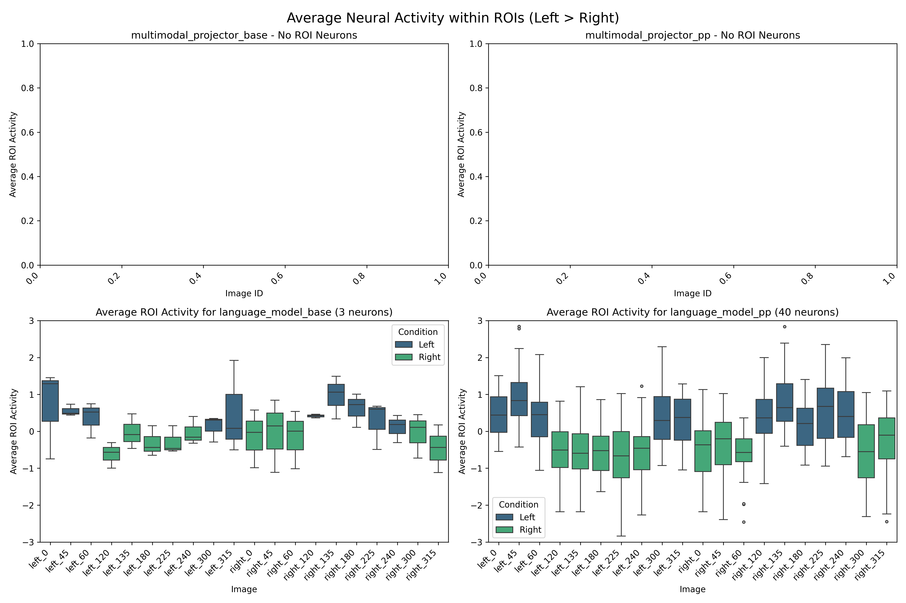

#### Right > left cube ROI

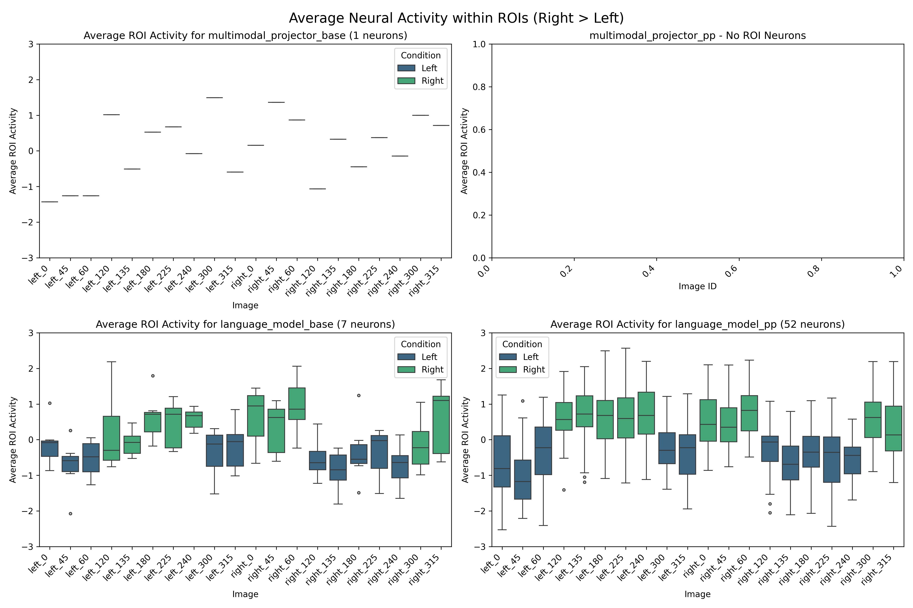

For both models, close to 0 neurons were significantly activated in response to the egocentric cube direction. The ROI in the pose model language layer was much larger than the base model, with a much clearer pattern of activation based on egocentric cube direction.

### Allocentric cube direction

Responses to allocentric cube direction rely on a combination of recognizing alignment and egocentric cube direction. We established these ROI in a similar manner to the egocentric ROIs, switching the variable of choice to allocentric cube direction instead. 

#### Allocentric left > right cube ROI

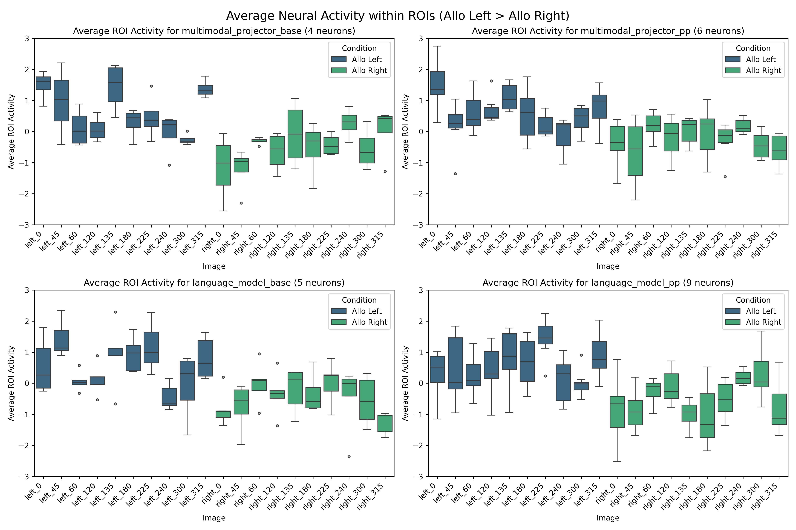

#### Allocentric right > left cube ROI

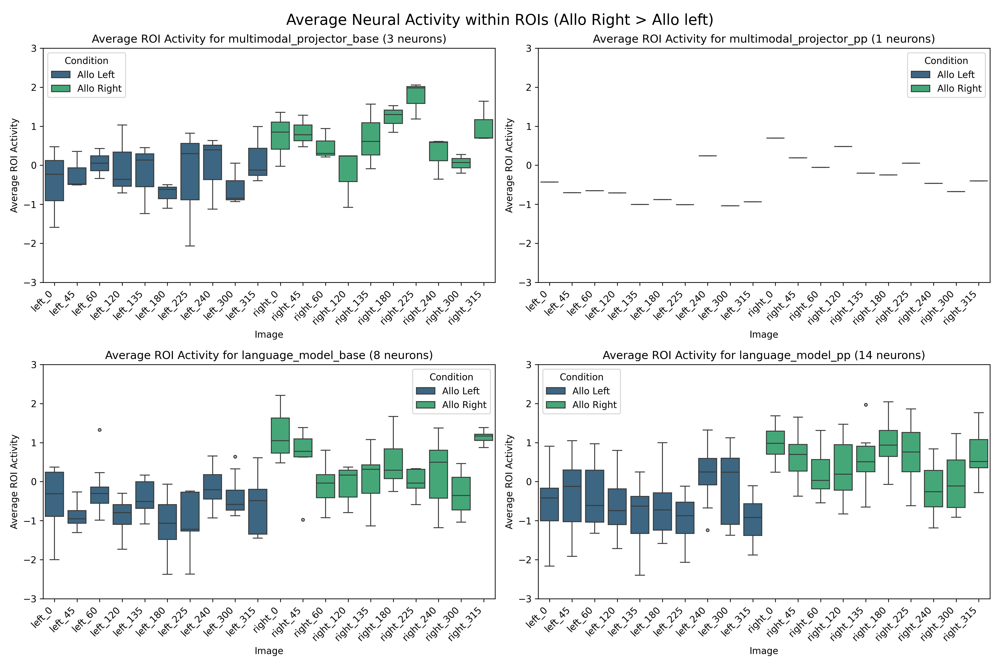

For both layers, ROIs in the pose model were larger than ROIs in the base model (with the exception of right > left multimodal layer). Patterns of activation were slightly clearer in the pose model ROIs than in the base model. For example, in the left > right comparison, left image activation distributions fall more in the positive range and right image activation distributions lie more in the negative range for pose model ROIs than base model ROIs. This pattern is similar in the right > left comparison as well. Few neurons in the pose model's multimodal layer for right > left ROI could explain its left-answer bias seen in the behavioral data above.

### Conclusions | Next steps

Fine-tuning with pose tokens appears to enhance spatial representations of perspective-taking stimuli not by increasing activation strength, but by expanding the number of neurons encoding task-relevant information, that is, by enlarging the regions of interest (ROIs).

Given the polysemantic nature of neurons, where a single neuron may respond to multiple features, it is challenging to isolate the specific contributions of individual activations. As a next step, applying dictionary learning or dimensionality reduction techniques (e.g., PCA, ICA, or NMF) could help disentangle and identify latent task-relevant features. This would enable a more precise understanding of how fine-tuning with pose tokens reshapes internal representations and whether it introduces new specialized feature subspaces within the model.

---

## 🔍 Tips & Gotchas
* **Tokenizer order matters** – add all new tokens **before** LoRA init.
* Keep **atomic pose** samples 10 × larger than CoT early on (τ‑annealing).
* If training diverges, reduce `lr` from `2e‑4` → `1e‑4`

---

## 📚 Related Work
* **Perception Tokens / AURORA** (Bigverdi *et al.*, 2024) – depth & counting with VQ‑VAE tokens.  
* **Perspective Taking** – (Leonard *et al.*, 2024) - persepective-taking benchmark.
* **ViTPose** – (Xu *et al.*, 2022) - pose model used for token generation

---

### Acknowledgements
Inspired by the AURORA code‑base and tons of advice from the LLaVA community.
